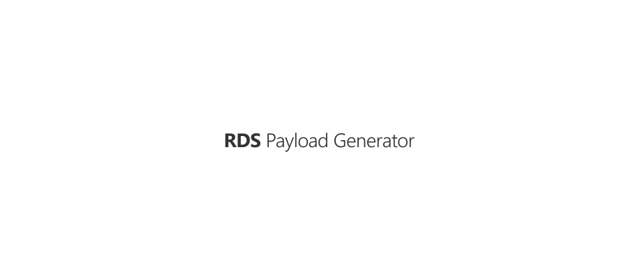

<p align="center"><a href="#readme"></a></p>

<p align="center">
  <a href="https://kaos.sh/w/rds-payload-generator/ci"></a>
  <a href="#license"></a>
</p>

<p align="center"><a href="#installation">Installation</a> • <a href="#usage">Usage</a> • <a href="#ci-status">CI Status</a> • <a href="#contributing">Contributing</a> • <a href="#license">License</a></p>

<br/>

`rds-payload-generator` is simple payload generator for [RDS](https://kaos.sh/rds).

### Installation

#### From source

To build the RDS Payload Generator from scratch, make sure you have a working Go 1.21+ workspace ([instructions](https://go.dev/doc/install)), then:

```
go install github.com/essentialkaos/rds-payload-generator@latest
```

#### Prebuilt binaries

You can download prebuilt binaries for Linux and macOS from [EK Apps Repository](https://apps.kaos.st/rds-payload-generator/latest):

```bash
bash <(curl -fsSL https://apps.kaos.st/get) rds-payload-generator
```

### Usage


### CI Status

| Branch | Status |
|--------|--------|
| `master` | [](https://kaos.sh/w/rds-payload-generator/ci?query=branch:master) |
| `develop` | [](https://kaos.sh/w/rds-payload-generator/ci?query=branch:develop) |

### Contributing

Before contributing to this project please read our [Contributing Guidelines](https://github.com/essentialkaos/contributing-guidelines#contributing-guidelines).

### License

[Apache License, Version 2.0](https://www.apache.org/licenses/LICENSE-2.0)

<p align="center"><a href="https://essentialkaos.com"></a></p>
